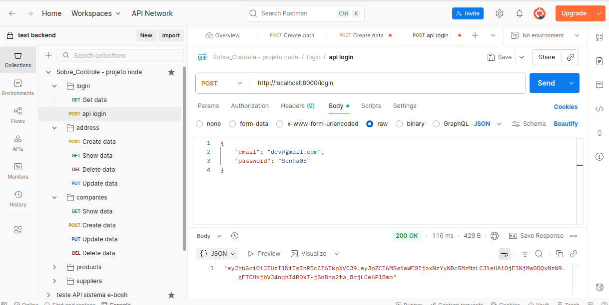
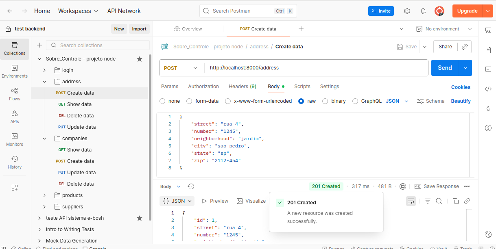
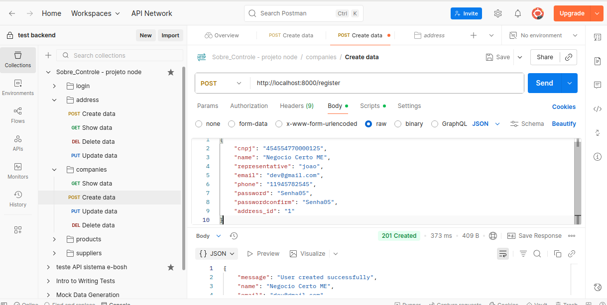

# 🧠 Sobre Controle – Backend Node.js
Este repositório apresenta o backend de um projeto Full-stack desenvolvido com foco em arquitetura escalável, segurança e boas práticas de engenharia de software. A aplicação foi construída com Node.js e Express, utilizando Sequelize como ORM e PostgreSQL como banco de dados. O objetivo é demonstrar domínio técnico em desenvolvimento backend moderno, com atenção à qualidade de código, modularidade e segurança.

## 🚀 Tecnologias Utilizadas
 - Backend: Node.js, Express.js
 - ORM: Sequelize
 - Banco de Dados: PostgreSQL
 - Autenticação: JWT (JSON Web Tokens)
 - Validação: Yup
 - Segurança: Bcrypt (hash de senhas)
 - Logging: Winston
 - Variáveis de Ambiente: Dotenv
 - Padrões de Código: ES Modules, Eslint
 - Configuração: Dotenv, CORS
 - gerenciar de pacotes: Yarn

## 🧱 Arquitetura e Boas Práticas
O projeto segue a arquitetura MVC (Model-View-Controller), promovendo separação de responsabilidades e facilitando manutenção e escalabilidade. Algumas práticas adotadas:

 - Logger centralizado com Winston para monitoramento e depuração
 - Uso de async/await para controle assíncrono limpo
 - Tratamento de erros padronizado para respostas consistentes
 - Validação com Yup para garantir integridade dos dados
 - Autenticação com JWT e hash de senhas com Bcrypt
 - Variáveis de ambiente (.env) para segurança e flexibilidade
 - CORS configurado para aceitar requisições apenas de origens seguras
 - ESLint para padronização e qualidade de código

## 🛠️ Como Rodar o Projeto

  ```
  # Clone o repositório:
   git clone https://github.com/DAVI-RJ/backend_node.js

  # Instale as dependências
  yarn install #ou npm install 
  ```
 #### Configuração do Banco de Dados (.env):
   Este projeto utiliza o Sequelize como ORM. Você precisará criar um arquivo .env na raiz do projeto com as credenciais do seu banco de dados e outras configurações essenciais.

  ```
   Exemplo de .env:
   	DB_HOST=localhost
		DB_USER=seu_usuario
		DB_PASS=sua_senha
		DB_NAME=seu_banco_de_dados
		DB_DIALECT=postgres
    JWT_SECRET=sua_chave_secreta_jwt
    PORT=3000
  ```

   As configurações específicas do Sequelize, como as definidas no config/config.js (geradas pelo Sequelize-CLI), devem ser ajustadas conforme seu ambiente local e sistema operacional. Cada ambiente pode ter variações em como o banco de dados é acessado.

  -Execute as migrações do banco de dados (se aplicável):
  ```
   npx (yarn ou npm) sequelize-cli db:migrate
  
  ```

  #### Inicie o servidor:
  ```
   yarn run dev

  ```
   O servidor estará rodando em http://localhost:[PORTA_CONFIGURADA_NO_ENV].

## 🧪 Testes e Qualidade
Teste feitos com o postman

#### Demonstração teste funcionais com prints 
  Para ter uma visão rápida das funcionalidades principais do projeto em ação e como as APIs se comportam, confira as demonstrações abaixo:
  - login empresa: 
  
  - Cadastro de endereço: 
  
  - Cadastro de usuário: 
  

## 📚 Aprendizados e Desafios
Este projeto nasceu como um exercício de aprendizado e evoluiu para um backend robusto. Durante o desenvolvimento, enfrentei desafios como:

- Migração de CommonJS para ES Modules, conciliando com ferramentas como sequelize-cli

- Entendimento profundo de separação de responsabilidades, clean code e design patterns

- Refatoração contínua para melhorar legibilidade, nomeação de variáveis e modularidade

Cada decisão técnica foi tomada com base em boas práticas e na busca por um código limpo, escalável e fácil de manter.
  
